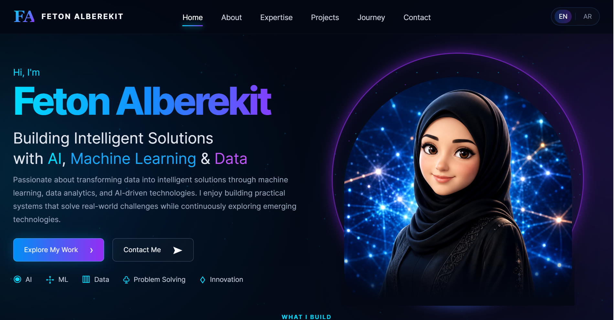

# 🌐 Personal Portfolio Website
<p align="center">
  
</p> 

A modern, responsive portfolio website showcasing my journey in Artificial Intelligence, featured projects, technical skills, and professional growth.

Designed with a clean user experience, bilingual support (Arabic & English), and a modern AI-inspired interface to provide recruiters, collaborators, and potential clients with a comprehensive overview of my work.

---

## 🚀 Live Demo

🔗 **Portfolio Website:**  
https://feton-alberekit.github.io/my_portfolio/

---

## ✨ Features

- 🌍 Bilingual support (Arabic & English)
- 📱 Fully responsive design
- 🎨 Modern AI-inspired UI
- ⚡ Smooth animations and transitions
- 💼 Professional project showcase
- 📬 Contact section
- 🌙 Dark modern interface

---

## 🛠️ Built With

- HTML5
- CSS3
- JavaScript

---

## 📂 Project Structure

```text
├── index.html
├── style.css
├── script.js
└── assets/
    ├── images
    ├── icons
    └── other resources
```

---

## 💼 Featured Projects

- 🏦 Home Credit Default Risk Prediction
- 📊 Telco Customer Churn Prediction
- ✋ Rock Paper Scissors Image Classification
- 🗄️ University Course Registration System

---

## 🎯 Project Goal

The goal of this portfolio is to create a professional online presence that highlights my technical background, practical AI projects, and continuous learning journey.

It serves as a central place where recruiters, collaborators, and potential clients can explore my work and learn more about my experience.

---

## 🔮 Future Improvements

- Add project filtering
- Add case studies for each project
- Integrate a backend contact form
- Add blog section
- Improve accessibility
- Enhance animations and interactions

---


⭐ If you like this project, feel free to explore my repositories and connect with me.
